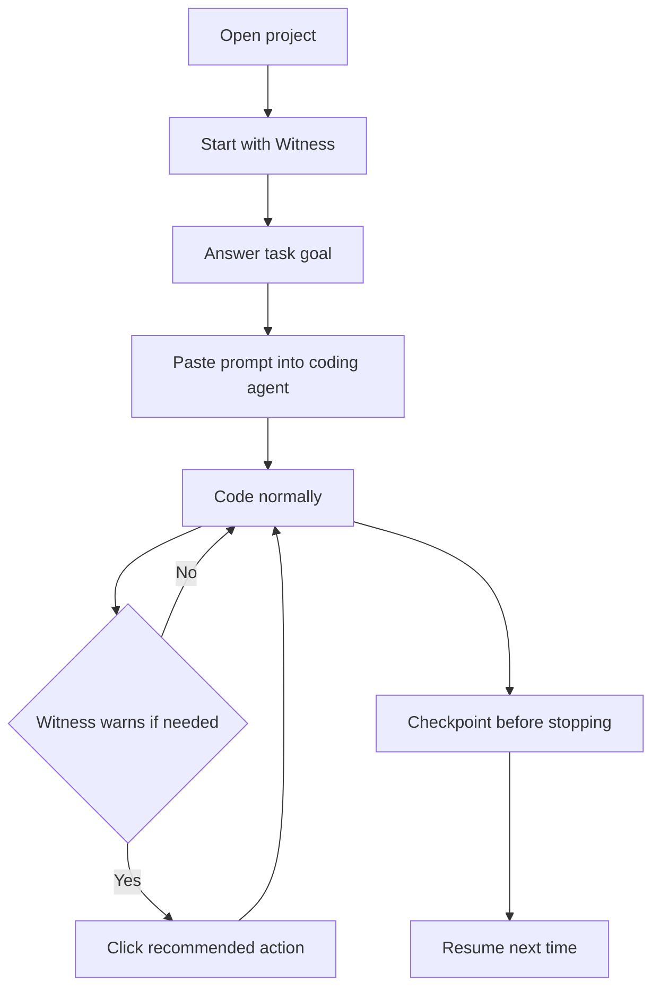

# Witness Agent v7 Implementation Plan

**Theme:** First-Use UX Compression
**Status:** CLOSED. All milestones v7.0–v7.6 complete. 31 public commands. 32 activation events.
**Opened:** 2026-05-24
**Closed:** 2026-05-25

---

## 1. v7 Summary

v5 made the beginner workflow better. It added beginner-safe commands, onboarding, a simpler
status bar, and copy-ready prompts so a new developer could start using Witness without first
learning every advanced command.

v6 added agent-assisted artifact maintenance. It introduced the prompt-and-validation loop where
an active coding agent may draft `.witness/` artifact updates, Witness validates artifact
boundaries and structure, and the developer approves.

First-user feedback still shows first-use confusion. The product idea is interesting, but the
learning curve is too high. New users do not reliably know how to initialize, when to start
tracking, when to checkpoint, how sessions relate to tasks, or how to restart cleanly. One
reviewer manually deleted session files because the safe restart path was not obvious.

v7 compresses onboarding into one guided path. The goal is not to add more expert capability. The
goal is to reduce visible complexity until a new user gets value before they understand the full
Witness method.

Advanced Witness concepts remain available, but they should be secondary. The first-use path
should be:

```text
Open project
-> Start with Witness
-> answer "What are you working on?"
-> paste prompt into coding agent
-> code normally
-> click Witness only when it recommends action
```

The framing shifts:

From:

> "Enable Witness, understand sessions, start tracking, understand checkpoints, then resume."

To:

> "Start with Witness, answer one question, paste prompt, code normally."

---

## 2. Adoption Problem

The current first-use experience exposes too much of the system too early.

Pain points:

- Too many visible commands appear before the user knows which one matters.
- Too many concepts appear early: project initialization, sessions, task tracking, checkpoints,
  handovers, resume, and validation.
- Initialization vs. session vs. task tracking is confusing. New users reasonably ask whether
  they should enable the project, start a session, or start tracking a task.
- Checkpoints are useful, but it is unclear when a beginner should create one.
- Restarting or starting a new task is unclear, especially when an active session already exists.
- Users may manually delete `.witness/` files or session files to "start over" because a safe
  restart action is not obvious.

The following concepts should not appear early in the first-use path:

- handover
- context packet
- risk dimensions
- subagent ledger
- artifact validation
- telemetry
- harness protocols
- ADRs
- evaluation summary

These are valid advanced concepts. They are not first-use concepts. A new user should be able to
receive Witness value before learning any of them.

---

## 3. v7 Beginner Mental Model

The beginner mental model is:

> "Witness keeps project memory for my AI coding work."

A beginner should only need to learn:

1. Start with Witness.
2. Paste the generated prompt into the coding agent.
3. Code normally.
4. Click Witness when it warns.
5. Checkpoint before stopping.
6. Resume with Witness next time.

Everything else is progressive disclosure.

---

## 4. v7 Design Principles

These principles are locked for v7:

1. First value before first explanation.
2. One command should get a new user to first value.
3. Use user-intent names, not internal architecture names.
4. Teach moments, not concepts.
5. Keep advanced commands available but secondary.
6. Never require users to delete `.witness/` files manually.
7. Use visual guidance for when/why, not only command reference.
8. Status bar should show state and next action, not methodology.

---

## 5. Naming Strategy

Do not rename all existing advanced commands immediately. Command IDs and existing command names
are part of the extension's current surface area and should remain stable unless there is a
separate migration plan.

Instead:

- Keep existing command IDs stable.
- Add beginner aliases or wrappers where a simpler entry point removes confusion.
- Use beginner-facing names in README, onboarding, walkthroughs, and status bar guidance.
- Leave advanced commands available in the Command Palette for experienced users.

| Internal / technical name | Beginner-facing name |
|---|---|
| Initialize Project | Enable Witness |
| Start Session | Start Tracking This Task |
| Enable + Start Tracking | Start with Witness |
| Compress Current State | Update Project Memory |
| Create Context Packet | Prepare Resume Context |
| Validate Artifact Maintenance | Check Agent Memory Update |
| Subagent Ledger | Subagent Work Record |
| Resume Probe | Resume Check |
| Assess Continuity Risk | Check Project Memory Risk |

---

## 6. v7.1 — Start with Witness

**Status:** Complete.

**Command title:** `Witness: Start with Witness`

**Command ID:** `witness.startWithWitness`

**Purpose:** One-command beginner entry point.

### Behavior

1. If `.witness/` is missing, initialize it using existing project enable/init logic.
2. Ask: "What are you working on?"
3. Validate vague input using the same rules as `Witness: Start Tracking This Task`.
4. Create the first or next Witness tracking session using existing session logic.
5. Generate the same copy-ready coding-agent prompt as `Witness: Start Tracking This Task`.
6. Open the prompt in an unsaved markdown tab.
7. Offer `Copy Prompt`.
8. Show a clear next step: "Paste this prompt into your coding agent and start coding."

### Important Constraints

- Do not require the user to run `Witness: Enable for This Project` first.
- Do not require the user to understand Witness sessions first.
- Do not start a coding-agent session automatically.
- Do not inject the prompt automatically.
- Do not call any LLM.

### Expected Result

The first-use path becomes one command plus one question.

### v7.1 Implementation Notes

Implemented in `src/commands/startWithWitness.ts`. The command checks for an open workspace,
initializes `.witness/` with `performProjectInit` only when `.witness/index.md` is missing, asks
for the task goal using the shared beginner validation flow, creates a tracking session using the
same session helper as `Witness: Start Tracking This Task`, and opens the same generated start-task
prompt through `presentPrompt`.

The `Witness: Start Tracking This Task` command now shares small helper functions for task-goal
prompting, tracking-session creation, and prompt presentation. Its user-facing behavior is
unchanged.

v7.1 adds one public command and one activation event:

- `witness.startWithWitness`
- `onCommand:witness.startWithWitness`

Expected counts after v7.1:

- public commands: 30
- activation events: 31
- public `registerCommand` calls in `src/extension.ts`: 30
- runtime dependencies: 0

The command does not open onboarding automatically, call an LLM, inject prompts into coding
agents, overwrite existing `.witness/` files, or change advanced command behavior.

---

## 7. v7.2 — Visual Walkthrough

**Status:** Complete.

Plan a native VS Code Walkthrough contribution.

**Walkthrough title:** `Witness: AI Coding Continuity`

**Purpose:** Show new users the workflow visually inside VS Code.

Suggested steps:

1. Start with Witness
2. Paste prompt into coding agent
3. Code normally
4. Watch the Witness status bar
5. Create Checkpoint before stopping
6. Resume with Witness next time

Keep the walkthrough short. Do not explain all advanced commands. Each step should include:

- one short explanation
- one command/action link if possible
- no long methodology text

Add a Mermaid visual flow to onboarding, README, or docs where appropriate:



### v7.2 Implementation Notes

Implemented as a native VS Code walkthrough contribution in `package.json` under
`contributes.walkthroughs`.

Walkthrough:

- id: `witness-ai-coding-continuity`
- title: `Witness: AI Coding Continuity`
- description: `Start using Witness to keep project memory for AI-assisted coding workflows.`

The walkthrough includes six short steps:

1. Start with Witness
2. Paste the Prompt into Your Coding Agent
3. Code Normally
4. Use the Witness Status Bar
5. Create Checkpoint
6. Resume with Witness

Each step uses concise text and a markdown media file under `media/walkthrough/`. Command links
are included only for the direct beginner actions:

- `witness.startWithWitness`
- `witness.showWorkspaceStatus`
- `witness.createCheckpoint`
- `witness.resumeWithWitness`

The first-run onboarding content now includes a compact plain-text visual workflow. Mermaid was
not used in onboarding so the flow remains readable in any VS Code markdown surface.

v7.2 does not add public commands, activation events, dependencies, webviews, LLM calls, automatic
prompt injection, or status bar behavior changes.

---

## 8. v7.3 — Start New Task / Restart Tracking

**Status:** Complete.

**Preferred command title:** `Witness: Start New Task`

**Command ID:** `witness.startNewTask`

**Purpose:** Prevent users from deleting session files manually when they want to restart.

### Behavior

1. Detect active session.
2. If an active session exists, ask: "Start a new task and keep the current session archived?"
3. Present options:
   - `Start New Task`
   - `Open Current Session`
   - `Cancel`
4. If `Start New Task`:
   - do not delete old session files
   - archive or close the current active session if the current system supports it
   - ask "What are you working on?"
   - create a new tracking session
   - generate a copy-ready prompt
5. If no active session exists:
   - behave like `Witness: Start Tracking This Task` or `Witness: Start with Witness`

### Important Constraints

- Never ask the user to delete `.witness/sessions/`.
- Preserve old session artifacts.
- Do not automatically generate a handover unless the user confirms.

### Open Question

Does the current architecture support "closing" an active session cleanly, or does v7 need a
minimal active-session pointer/update mechanism?

### v7.3 Implementation Notes

Implemented in `src/commands/startNewTask.ts`.

The command is orchestration-only:

1. Requires an open workspace.
2. Requires `.witness/index.md` to exist and tells the user to run `Witness: Start with Witness`
   first if Witness is not enabled.
3. Computes workspace status with `computeWorkspaceStatus` when possible, with
   `getCurrentSessionId` as a fallback.
4. If an active session exists, offers `Start New Task`, `Open Current Session`, and `Cancel`.
5. `Open Current Session` opens `.witness/sessions/<active-session-id>.md` if present and does
   not create a new session.
6. `Start New Task` reuses the shared task-goal prompt helper and vague-goal warning.
7. If an active session existed, asks whether to run `Witness: Create Checkpoint` first.
8. Creates the new tracking session through the shared session helper and opens the same
   copy-ready start-task prompt.

The current architecture does not have a formal "closed session" marker. v7.3 preserves old
session files untouched and lets the shared session creation helper update `.witness/.current-session`
to the new session. This is the minimal safe active-session pointer mechanism already used by
existing session commands.

v7.3 adds one public command and one activation event:

- `witness.startNewTask`
- `onCommand:witness.startNewTask`

Expected counts after v7.3:

- public commands: 31
- activation events: 32
- public `registerCommand` calls in `src/extension.ts`: 31
- runtime dependencies: 0

The command does not delete session files, delete `.witness/`, generate handovers automatically,
generate checkpoints unless the user explicitly chooses that option, call an LLM, or inject prompts
into coding agents.

---

## 9. v7.4 — Status Bar Wording Cleanup

**Status:** Complete.

Simplify status bar wording without removing advanced commands.

Previous sections:

- Recommended
- Beginner Actions
- Advanced Actions

Changed to:

- Recommended
- Main Actions
- More Actions

Reason: `Advanced Actions` can make new users feel they are missing something. `More Actions` is
softer and less intimidating.

Status bar click should show:

1. one recommended action
2. small main action set
3. more actions lower down

Do not remove advanced commands from the Command Palette.

### v7.4 Implementation Notes

Implemented in `src/core/statusBar.ts` as a wording-only change.

QuickPick separator labels changed from:

- `Beginner Actions` to `Main Actions`
- `Advanced Actions` to `More Actions`

`Recommended` remains unchanged.

Behavior is unchanged:

- same recommended action logic
- same command IDs
- same command order
- same deduplication behavior
- same tooltip behavior
- same internal status bar command
- no telemetry changes

README status bar documentation was updated to match the new section names. Historical v5/v6
implementation and validation notes still preserve the old labels where they describe past
milestones.

---

## 10. v7.5 — README / Onboarding Naming Cleanup

**Status:** Complete.

Plan docs updates after v7.1 through v7.4 are implemented.

README should promote:

- `Witness: Start with Witness` as the main first command
- `Witness: Start Tracking This Task` as secondary/manual
- `Witness: Start New Task` as safe recovery
- a visual flow
- fewer command names early

Do not list all commands in the main onboarding path. The first-user README should teach the
minimum loop first, then link to advanced command reference material.

### v7.5 Implementation Notes

Implemented in `README.md` and `src/core/onboardingContent.ts`.

README now presents `Witness: Start with Witness` as the primary first-use command. The first-use
path is organized as Quick Start, 5-Minute Workflow, and Tutorial sections:

1. Start with Witness.
2. Answer "What are you working on?"
3. Paste the prompt into your coding agent.
4. Code normally.
5. Click Witness when it recommends action.
6. Create Checkpoint before stopping.
7. Resume with Witness next time.

`Witness: Enable for This Project` and `Witness: Start Tracking This Task` remain documented as
manual / secondary beginner commands for users who want separate control over setup and task
tracking.

`Witness: Start New Task` is documented as the safe task-switching path. It preserves old session
files and prevents manual deletion of `.witness/sessions/`.

README also now mentions the native VS Code walkthrough, uses the v7.4 `Main Actions` /
`More Actions` status bar wording, and records the current v7.5 counts:

- public commands: 31
- activation events: 32
- runtime dependencies: 0

The onboarding page already used `Witness: Start with Witness` as the main next step. v7.5 adds
`Witness: Start New Task` to the short useful-command list while keeping the page concise.

---

## 11. v7.6 — Fresh-User Usability Regression

**Status:** Complete.

Create a usability regression report:

```text
docs/v7-validation-report.md
```

Test that a new user can:

1. open a repo
2. run `Witness: Start with Witness`
3. answer one task question
4. paste the prompt into a coding agent
5. identify status bar meaning
6. create a checkpoint
7. resume with Witness
8. start a new task without deleting files

Success criteria:

- first value within 2 minutes
- no manual `.witness/` file deletion
- no need to understand handovers, context packets, or subagent ledger before first use
- user can explain what Witness does in one sentence
- user knows what to click next

### v7.6 Implementation Notes

Created `docs/v7-validation-report.md`.

The report validates:

- original first-use usability problem
- final v7 capability summary
- final command, activation event, registerCommand, and dependency counts
- v7.1 `Witness: Start with Witness`
- v7.2 native VS Code walkthrough and onboarding visual flow
- v7.3 `Witness: Start New Task`
- v7.4 status bar wording cleanup
- v7.5 README/onboarding naming cleanup
- fresh-user regression checklist
- non-goals preserved
- known limitations

Final v7 counts:

- public commands: 31
- activation events: 32
- public `registerCommand` calls in `src/extension.ts`: 31
- runtime dependencies: 0

`witness.openStatusActions` remains internal only and absent from `package.json`.

v7 is closed.

---

## 12. Non-Goals

v7 must not include:

- code graph
- context lifecycle OS
- automatic memory consolidation worker
- direct LLM API integration
- MCP server
- marketplace polish
- webview dashboard
- automatic source-code modification
- automatic prompt injection
- automatic session switching
- hidden transcript capture
- hidden reasoning capture
- removing advanced commands

---

## 13. v7 Milestones

| Milestone | Scope |
|---|---|
| v7.0 — UX Compression Plan | Create this implementation plan. Docs only. |
| v7.1 — Start with Witness command | Add one-command beginner entry point. |
| v7.2 — Native VS Code Walkthrough + visual flow | Add VS Code walkthrough and short visual flow. |
| v7.3 — Start New Task / Restart Tracking | Add safe recovery path for beginning a new task. |
| v7.4 — Status bar wording cleanup | Rename status bar sections for lower intimidation. |
| v7.5 — README/onboarding naming cleanup | Promote the compressed first-use path in docs. |
| v7.6 — Fresh-user usability regression | Validate the first-use path and publish report. |

---

## 14. Open Questions

**Q1. Should `Start with Witness` replace `Enable Witness` in README as the primary first
command?**

Likely yes. `Enable Witness` can remain documented as a setup/detail command, but the main first
path should lead with the intent: start using Witness now.

**Q2. Should `Start with Witness` call `enableProject` logic or `performProjectInit` directly?**

Prefer reusing the highest-level existing enable flow if it preserves onboarding behavior and
write-if-missing semantics. Use lower-level initialization only if the wrapper would duplicate
prompts or create confusing nested messages.

**Q3. Should `Start with Witness` reuse `startTrackingTask` logic through a shared helper?**

Likely yes. The command should not fork prompt generation or task-goal validation behavior. v7.1
should extract a shared helper if needed.

**Q4. How should active session be "closed" or "archived" for `Start New Task`?**

The current session artifacts should remain untouched. The minimal model may be updating the
active-session pointer to a newly created session while leaving prior session files as historical
records. If a formal closed marker is needed, define it explicitly before implementation.

**Q5. Should `Start New Task` create a checkpoint before switching tasks?**

Default should be to ask, not to do it automatically. A recommended checkpoint option may be useful
when there are meaningful changes, but automatic handover or checkpoint generation would cross the
confirmed-action boundary.

**Q6. Should the VS Code Walkthrough be contributed in `package.json` using the walkthroughs
contribution point?**

Likely yes. That is the native VS Code surface for first-run guidance, but it will change
`package.json` in v7.2, not v7.0.

**Q7. Should `Advanced Actions` be renamed to `More Actions` only in status bar, or also in docs?**

Resolved in v7.4/v7.5: use `More Actions` in the status bar and current beginner-facing docs.
Historical implementation and validation notes may still use the old wording when describing
past milestones.

**Q8. Should old beginner commands remain visible even if `Start with Witness` becomes primary?**

Yes. Keep compatibility and avoid surprising existing users. v7 should reprioritize, not remove.

**Q9. What is the exact acceptance test for "first value within 2 minutes"?**

Suggested acceptance test: from a fresh VS Code workspace with the extension installed, a user can
run `Witness: Start with Witness`, answer the task prompt, see the generated coding-agent prompt,
and understand the next action within 2 minutes without reading external documentation.

---

## 15. Validation Plan

v7 validation should include:

- compile check
- command count check
- activation event count check
- fresh workspace test
- already-initialized workspace test
- `Start with Witness` smoke test
- `Start New Task` smoke test
- walkthrough visibility test
- status bar wording test
- README first-user review
- no automatic injection test
- no LLM call test

Constraints:

- v7.0 is docs only.
- No source code changes in v7.0.
- No `package.json` changes in v7.0.
- No dependency changes.
- No command additions in v7.0.
- No emojis.
- Keep Witness VS Code-first.
- Keep advanced commands available.
- Do not overclaim direct coding-agent integration.
- Do not claim true hidden token pressure detection.
- Do not make Witness an autonomous coding agent.

Final v7 validation:

1. `npm run compile`
2. `package.json` contributes.commands remains 31
3. `package.json` activationEvents remains 32
4. `extension.ts` public `registerCommand` count remains 31
5. runtime dependency count remains 0
6. `witness.openStatusActions` remains absent from `package.json`

---

*End of v7 Implementation Plan.*
